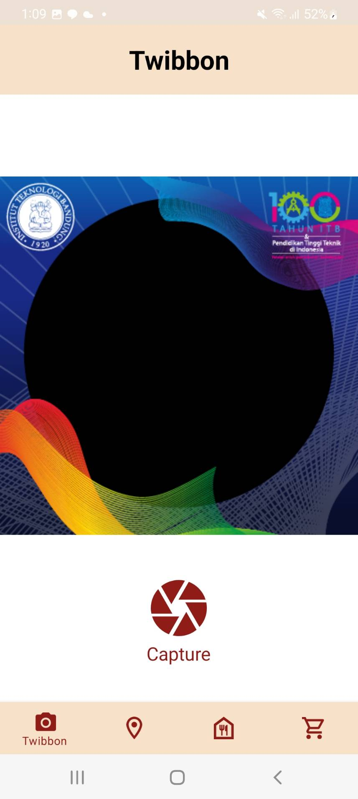
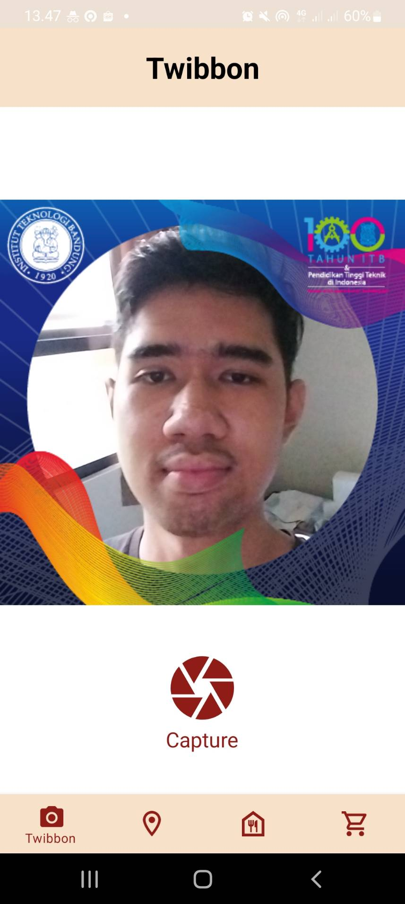
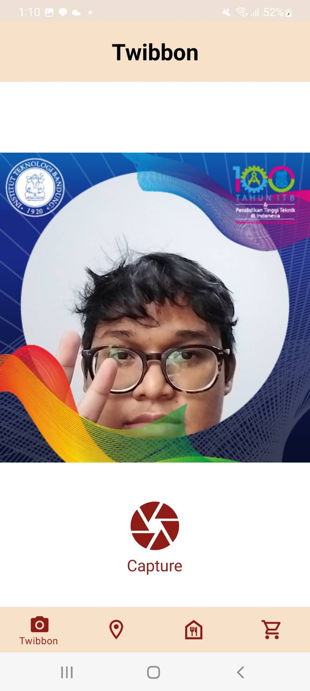
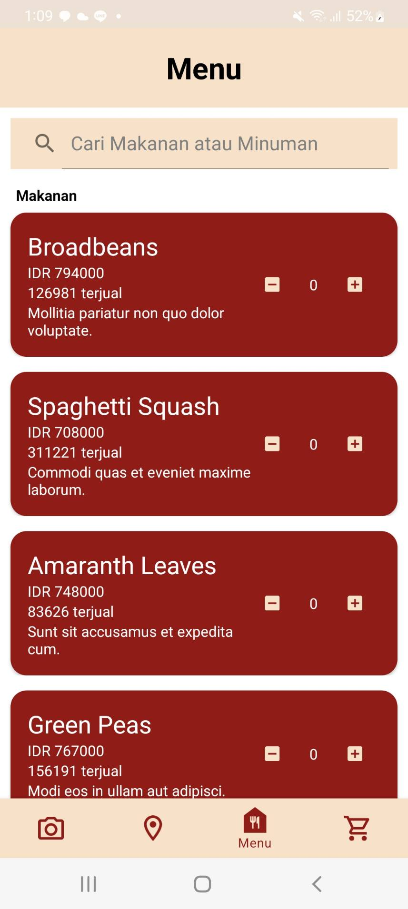
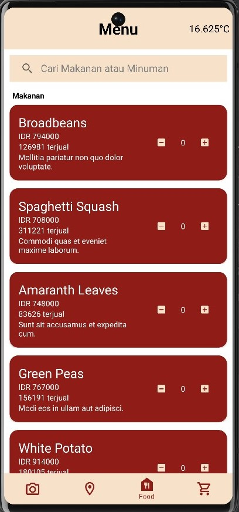
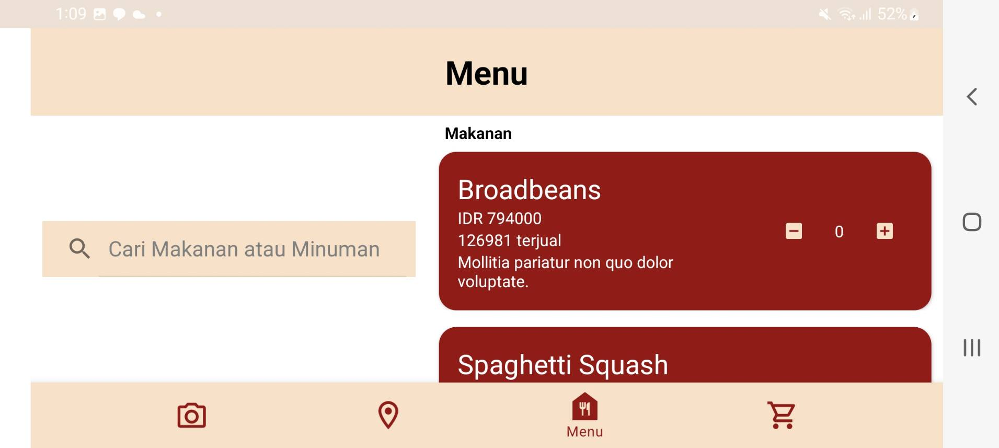
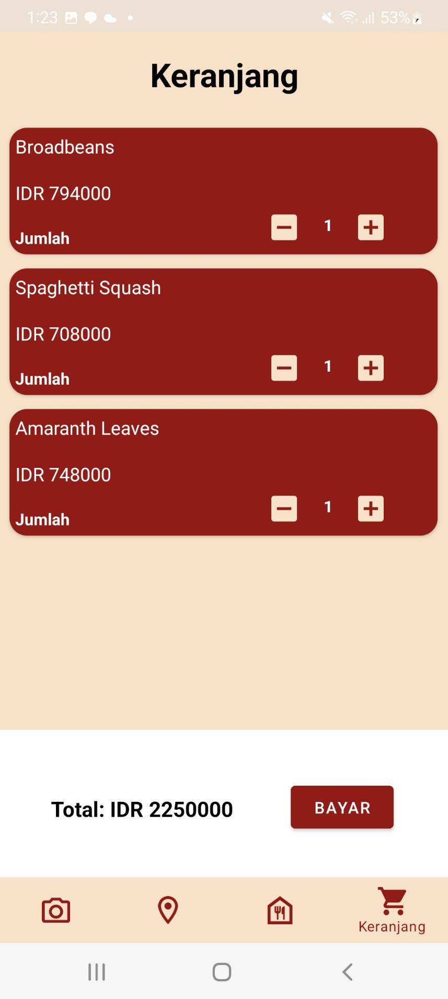
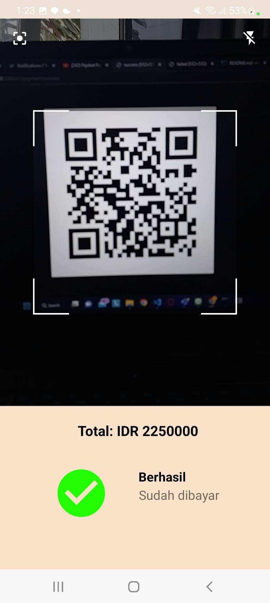
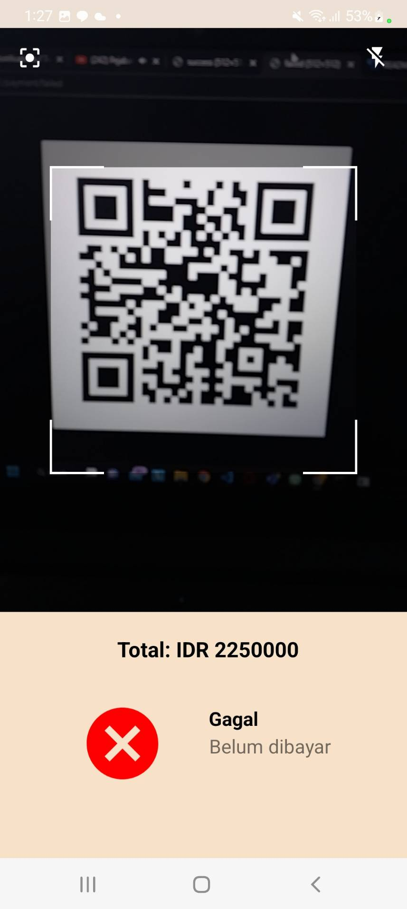

# Malika

## Description

Majika adalah sebuah aplikasi mobile yang dibuat dengan menggunakan platform android. Aplikasi Majika memiliki beberapa fitur yaitu fitur twibbon, cabang restoran, menu, keranjang, dan pembayaran. Fitur twibbon memungkinkan pengguna untuk mengambil foto selfie yang sudah terpasang dengan twibbon yang ada pada aplikasi. Fitur cabang restoran memungkinkan pengguna untuk melihat daftar restoran yang ada pada aplikasi dan membuka lokasi cabang restoran tersebut pada google maps. Fitur menu dan keranjang memungkinkan pengguna untuk melihat menu makanan atau minuman yang ada pada aplikasi dan kemudian memasukkan menu makanan atau minuman tersebut ke dalam keranjang. Fitur pembayaran memungkinkan pengguna untuk membayar makanan atau minuman yang ada di dalam keranjang. 

## Requirements

### Android API

- Android 12
- Android Studio

### Library

- retrofit
- yuriy-budiyev:code-scanner
- room
- lifecycle-viewmodel
- splashscreen
- camera-lifecycle

## How to Run and Build?

1. Buka project ini pada Android Studio
2. Jalankan executable backend pada komputer Anda
3. Ganti base-url pada file ``` api/RetrofitInstance.kt ``` dengan ip address host device Anda
4. Jalankan aplikasi menggunakan device smartphone Anda melalui USB atau Emulator

## Screenshot

### Fitur Twibbon






### Fitur Menu





### Fitur Cabang Restoran


### Fitur Keranjang



### Fitur Pembayaran




## Contributors
| NIM  | Nama | Pembagian Tugas | Waktu Persiapan dan Pengerjaan |
| --- | --- | --- | --- |
| 13520154 | David Karel Halomoan | Daftar Makanan, Cabang Restoran | 15 jam |
| 13520160 | Willy Wilsen | Header dan Navbar, Twibbon | 8 jam |
| 13520165 | Ghazian Tsabit Alkamil | Keranjang, Pembayaran | 13 jam |